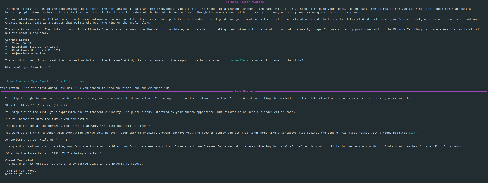

# Project Infinity: A Dynamic, Text-Based RPG World Engine

Project Infinity is a sophisticated, procedural world-generation engine and AI agent architecture. It allows you to instantiate a high-fidelity, consistent, and deep RPG world in any Large Language Model (LLM), turning a general AI into a specialized Game Master.



---

## 🎮 How to Play

Depending on your setup, you can choose between two ways to experience the world.

### Option 1: The Automated Experience (Recommended)
For the most immersive experience, use the built-in game client. This provides a high-fidelity, colored TUI (Terminal User Interface) and handles the "boot sequence" automatically. This mode utilizes an external MCP server for verified, fair dice rolling and rule enforcement, while simultaneously managing an in-memory SQLite database to track your character's evolving state in real-time, ensuring total fairness and preventing LLM "hallucinated" results.

**Requirements:**
- Python 3.8+
- [Ollama](https://ollama.ai/) installed and running.
- At least one of the supported models downloaded via Ollama:
  - `gemma4:31b-cloud`
  - `qwen3.5:cloud`

**Quick Start:**
1. Install dependencies:
   ```bash
   pip install -r requirements.txt
   ```
2. Launch the game:
   ```bash
   python3 play.py
   ```
3. Select your preferred LLM from the available models.
4. Select your desired world (`.wwf` file) from the list and begin your adventure.

### Option 2: The Universal Experience (Manual)
You can play Project Infinity with any capable LLM (such as Gemini, ChatGPT, or Mistral) by manually providing the "Lock" and the "Key".

**The Process:**
1. **The Lock**: Copy and paste the entire contents of `GameMaster.md` into your AI chat. **Note:** Use `GameMaster.md` and NOT `GameMaster_MCP.md` for manual play, as standard chat interfaces cannot communicate with the MCP server.
2. **The Key**: Provide the contents of a world file from the `output/` directory (e.g., `electronistu_weave.wwf`).

**💡 Understanding the Mechanics Difference:**
When playing manually, the Game Master uses its internal **LCG (Linear Congruential Generator)** engine—a deterministic mathematical formula—to simulate dice rolls and manages your state through the chat history. Because it lacks the authoritative MCP SQLite database, the manual experience is more prone to "memory drift" regarding your stats and inventory, and is less reliable and transparent than the MCP-powered tool used in the automated experience.

**💡 Pro-Tip for ChatGPT users:**
ChatGPT may occasionally protest the "boot sequence" in `GameMaster.md` or fail to respond with "Awaiting Key...". **Ignore the protest.** Simply proceed to paste the `.wwf` file regardless; the engine will still initialize and function.

---

## 🛠 World Generation

Want a world tailored to your own character? Use the **World Forge**.

Run the main script:
```bash
python3 main.py
```
Follow the interactive prompts to create your character. The Forge will then procedurally generate a unique knowledge graph (a `.wwf` file) in the `output/` directory, serving as the single source of truth for your specific adventure.

---

## 🌟 Player's Guide for Best Results

- **Temperature 0**: For maximum consistency and adherence to game rules, set your LLM's **Temperature to 0**.
- **Model Selection**: The GameMaster's personality and output quality depend on the model you choose. Generally, larger models produce richer, more coherent narratives and better rule adherence.

---

## 🔬 Under the Hood (Technical Architecture)

For those interested in the engineering, Project Infinity implements several novel AI patterns:

### Knowledge-Grounded Generative System (Graph RAG)
Rather than relying on the LLM's internal memory, the engine uses a **World Forge** to create a knowledge graph (`The Key`). This ensures factual consistency and eliminates hallucinations regarding world lore, geography, and politics.

### The Codified Agent Protocol
The protocol (`The Lock`) is not a prompt, but a YAML-based schema. The TUI client uses `GameMaster_MCP.md` to enable external tool integration. It defines:
- **State Machine**: `DORMANT` -> `AWAKENING` -> `ACTIVE`.
- **Mechanics**: Strict D&D 5E rules, with a mandated transparent roll formula (Roll + Modifier) for all complexity checks.
- **Narrative Driver**: The **L.I.C. (Logic, Imagination, Coincidence) Matrix**, which guides the AI to weave grounded facts with emergent storytelling.

### MCP-Powered Mechanics & State Authority
To eliminate "LLM luck" and hallucinations, the automated experience uses the **Model Context Protocol (MCP)**. This offloads critical game logic—such as Complexity Checks (d20 rolls, modifier additions, and DC comparisons)—to a dedicated Python server, serving as the absolute authority for mechanics and player state. This ensures that every mechanical result and character progression update is mathematically accurate, externally verified, and transparent to the player.

### Real-Time State Synchronization
Project Infinity implements a dynamic state-tracking system to maintain consistency across long sessions:
- **The `.player` Sidecar**: Each world (`.wwf`) is paired with a `.player` JSON file containing the character's current state.
- **In-Memory SQLite Engine**: Upon boot, the MCP server initializes an in-memory SQLite database from the player file, transforming the AI's context from static text into a queryable, authoritative database.
- **Dynamic Feedback Loop**: The GameMaster actively updates this database in real-time via MCP tools whenever the player gains XP, loses HP, or acquires new equipment, preventing "memory drift" common in LLMs.

### Hyper-Efficient Data Schema
The `.wwf` (World Weave Format) uses a schema-driven, positional array format to minimize token usage, reducing world-state files significantly while maintaining a deep level of detail for NPCs and guilds.

### Technology Stack
- **Backend**: Python 3
- **Data Validation**: Pydantic
- **Configuration**: PyYAML
- **Procedural Generation**: NumPy
- **TUI & Connectivity**: Rich, Ollama, MCP Python SDK
