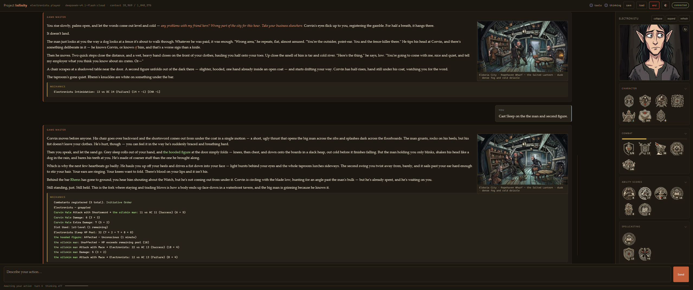
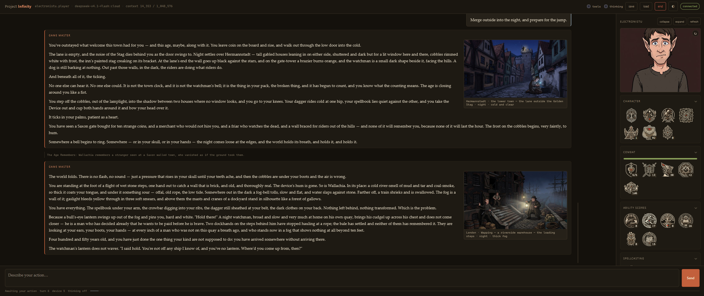

# Project Infinity

*A text-based RPG where an AI Dungeon Master runs real D&D 5e — with mechanical rolls, persistent state, and SRD 5.1 rules enforced by a dedicated game engine. Played in your browser.*

*Local web client · Ollama Cloud & Google Gemini models*

You type what your character does. The Game Master answers in prose, and every roll, hit, spell and coin behind it was resolved by a real game engine — not invented by the model. Your character, your gear and your standing persist between sessions.

**Images are optional but recommended** — they carry your character's portrait, an illustration of each turn, and the place-and-NPC memory the story is built on.

---

## Two games, one character

You pick one when you create the character. Everything else — the rules engine, the sheet, the images, the saving — is the same game either way.

### Classic — the invented world



An invented realm of four kingdoms, a decade after a war that ended in an uneasy peace: old grievances, guarded borders, and a peace nobody trusts. A straightforward campaign, played straight — the Game Master builds the story on top of the political scaffold.

### Time Traveler — the Device



You are a Traveler from the future, carrying a **hollow** timepiece missing the four parts that make it work. It fires when it likes and throws you between historical ages — the Old Kingdom of Egypt, the High Tang, Wallachia under Vlad III, Victorian Britain — and the way home is to find what it lost.

Every age is peopled by **all the common races** — dwarf, elf, halfling, human, dragonborn, gnome, half-elf, half-orc, tiefling — and by all the common classes, living there as they always have; a crowd is mixed and nobody finds it strange. The history stays real. What **does** stand out is your **kit**: a pistol bought in 1888 is a pistol in 2560 BC, people notice, and nothing is ever translated for you.

**Your first age is rolled at random** when the character is created, and so is every later one.

---

## Run it

**You need:** Python 3.11+, and [Ollama](https://ollama.ai/) installed and signed in (the default Game Master models are Ollama Cloud tags). A Google AI Studio API key is **recommended** — it unlocks all image generation (portrait, scenes, sheet icons) and the Gemini Game Master models. Without it the game runs text-only.

```bash
git clone <repo-url>
cd Project_Infinity
python3 -m venv venv
source venv/bin/activate      # Linux/macOS
# venv\Scripts\activate       # Windows
pip install -r requirements.txt
```

Copy `.env.example` to `.env` and set `GEMINI_API_KEY` — with it, images are on; without it, the game runs text-only.

```bash
venv\Scripts\python.exe web_server.py     # Windows
python3 web_server.py                     # Linux / macOS
```

Open **http://127.0.0.1:8000**. The server binds to localhost only. Flags: `--host`, `--port`, `--reload`, `--log-level`.

---

## Creating a character

**Create character** on the start screen opens the in-browser **Character Forge**: the full SRD 5.1 creation flow, asked one step at a time.

- **Name and gender.**
- **Difficulty.** **Hard** plays strict SRD as written — a lone hero in a party-of-four world. **Easy** keeps exactly the same strict resolution but tells the Game Master to scale the *adventure* around you: encounters, tactics, pacing, DCs, and how failure is handled. The rules never change; the world does.
- **Game.** **Classic** (the default) or **Time Traveler**.
- **Race**, and **subrace** where the race has one — the nine SRD races. Then **age**, bounded by that race's own lifespan (a gnome matures at 40 and can live past 400), which colours your portrait and how people treat you.
- **Class** and **background**, the twelve SRD classes and the SRD backgrounds.
- **Ability scores** by point-buy — all 27 points must be spent, each score between 8 and 15 — then the racial bonuses, and any floating choice your race grants.
- **Skills**, **alignment**, and for casters a **spellbook** chosen from the SRD lists.
- **Starting equipment** from your class and background, and your **languages**.

Your character is written to `output/yourcharacter.player`. **In Time Traveler, the Forge rolls your first age** and the arrival point inside it — the Device cannot aim — and seeds your standing in that age's own powers.

---

## Playing

Type an action in plain English — *"I ask the innkeeper about the strangers who came through last week"* — and the Game Master handles the rest. You do not roll anything and you do not need to know the rules.

**A turn looks like this.** Your action goes to the GM. The status line may briefly show *"synchronizing with the engine…"* while it resolves the mechanics, then *"GM is thinking…"*. The **narrative streams in** as second-person prose. At the end of the turn the **Mechanics panel** appears, written by the engine from the real results — who acted on whom, what was rolled, what changed. Status returns to *"Awaiting your action"*.

Nothing in that panel is generated by the model. If a blow lands, it landed; if a spell slot burned, it is gone.

### Your character sheet

**☰ Character sheet** opens the live sidebar — stats and modifiers, saving throws, skills with their passive scores, your spellbook and slots, inventory with tooltips for every item's stats, equipped gear and how your armour class is derived, active conditions, exhaustion, and your reputation with the powers of the age you are in. **Refresh** reloads it straight from the engine at any time; **↻** repaints your portrait from your current level and gear.

### Images (recommended)

> **Leave images on.** The game is designed image-first, and several things quietly depend on it:
> - **Both games** — the Game Master keeps a tree of the **places you have visited and the regulars who live there**, so locations and faces stay consistent.
> - **Time Traveler** — a jump lands in one of the **places you have already visited** in that age, and that list is only remembered while images are on.
> - Your **character portrait** and a cinematic **illustration of every turn**.
>
> With images off the game still runs — **text-only**: a generic arrival phrase, no portrait, no scenes, and no place memory.

Image generation needs the Google key (see **Run it**) and is **cached** — an image is drawn once and reused until the data behind it changes. Tick **images** on the start screen or in the Load dialog:

- **Character portrait** — on the start screen and your sheet.
- **Storyline scenes** — one cinematic 16:9 illustration per turn. Each place keeps a hidden establishing reference, so places and regulars stay consistent; **hover an illustration to see it full size**. Each carries a caption — area, place, time of day and weather.
- **Art style** — an optional free-text style applied to portraits and scenes (a cartoon, a period look); leave it empty for the default dark-fantasy sourcebook. Changing it repaints your portrait and redraws each place as you revisit it.
- **Sheet icons** — the shared, cross-character library used by the sheet.

Everything is cached and regenerates only when the data behind it changes.

### The Device (Time Traveler)

There is nothing to do but play out the age you are in.

- **A counter in the status bar** — `device 3` — shows how many **ordinary** turns are left before it fires, and turns warm on the last one. **A turn spent fighting is not one of them: the counter holds for the whole fight.**
- **The Game Master is warned on the last turn**, so the age can be closed properly rather than cut off mid-sentence.
- **Then it fires.** You come out *somewhere else in another age* — never where you meant, because the part that aims is missing.
- **The age you leave becomes one line.** Whatever that age saw, it remembers — permanently, and only for itself. Your story in each age carries forward as that memory, not as a transcript.
- **Nothing is left behind.** You keep everything you are carrying through every jump, and it stays literal: a Victorian pistol is a Victorian pistol in the Old Kingdom, and people will notice.
- **The Device is yours from the first turn** — a broken thing of the far future, in your inventory. Its four missing parts (the Escapement, the Compass Rose, the Regulator, the Mainspring) lie scattered across the ages; when you recover one, the Game Master adds it to your pack, and it records **which age you found it in**.
- **Every part buys time and control.** Alone it fires after **5 ordinary turns**, at random. **One** part: **7**, and once per jump you can **wait two more turns** — or, while at least three turns remain, **hasten it by two**. **Two**: **11**, and you can steer the *direction* — back to the last age you visited, or forward at random. **Three**: **13**, and you can **choose which age ahead** to travel to. **All four**: it stops firing on its own — **you decide where and when**. A long battle delays any jump by the battle's length, and a jump can never interrupt a fight.

### Saving and loading

**There is no autosave — progress persists only when you save.** Saving is **in place**: a save writes its own files and never renames them, because its images live under a folder keyed to its name. A save rewrites your character and appends a session **timeline**, the Game Master's concise summary of the story so far. Loading injects that timeline, so a long campaign stays coherent. Saves are listed on the start screen and in the **Load** picker.

### When the Game Master forgets something

The GM is an AI and can miss an update. If you spot one, **tell it directly** — exactly as you would a human DM. The engine is authoritative, so a direct instruction is all it takes to correct your state, or the GM will re-derive it on the next rule call.

This works for any missed mechanic: gold, inventory, spell slots, hit dice, conditions, or an item whose state changed (a note opened, a lamp lit). The sheet's **Refresh** button reloads your own view straight from the engine at any time.

### Controls

| Control | Where | What it does |
|---------|-------|--------------|
| **Save** | Header | Save the game in place (see above) |
| **Load** | Header | Load a saved game — from the start screen or mid-session |
| **End** | Header | End the session (**Save & end**, **End without saving**, or Cancel) |
| **Tools** | Header | Show or hide the GM's tool calls behind the scenes; each block shows the full result plus the green **GM sees** view |
| **Thinking** | Header | Show or hide the GM's reasoning |
| **Theme** | Header | Toggle **Candlelit Codex** (dark, default) and **Vellum** (light) |
| **☰ Character sheet** | Header | Open the live sidebar sheet |
| **Refresh** | Character sheet | Reload the sheet from the engine |
| **↻** | Character sheet | Regenerate the character portrait |
| **Enter** | Composer | Send your action (**Shift+Enter** for a new line) |
| **Hover a green combatant name** | Transcript | Show that combatant's **live sheet** — HP, AC, conditions, attacks, saves, traits. Names are highlighted wherever they appear, not just in the initiative order. |

### Choosing a model

The start screen offers curated models and, for the Ollama Cloud models, a sampling temperature.

| Model | Provider | Context |
|-------|----------|---------|
| `deepseek-v4.1-flash:cloud` | Ollama Cloud | 1,048,576 *(default)* |
| `deepseek-v4-pro:cloud` | Ollama Cloud | 1,000,000 |
| `kimi-k2.6:cloud` | Ollama Cloud | 250,000 |
| `gemini-3.8-flash` | Google | 1,048,576 |
| `gemini-3.6-flash` | Google | 1,048,576 |
| `gemini-3.5-flash` | Google | 1,048,576 |
| `gemini-3.5-flash-lite` | Google | 1,048,576 |
| `gemini-3.1-pro-preview` | Google | 1,048,576 |

The Google entries appear only when `GEMINI_API_KEY` is set. Gemini ignores custom sampling: `temperature`/`top_p`/`top_k` are deprecated and fixed to the model's optimal defaults, so the temperature control is disabled for Gemini models and each model uses its own reasoning effort. Ollama models keep the temperature control.

### How it works under the hood

Everything technical — the engine that resolves the rules, what the Game Master is allowed to see, how images stay consistent, how state is stored, and how to run the test gate — is in **[HowItWorks.md](HowItWorks.md)**.

---

## Licensing & Legal

This project has a **dual-license structure** to comply with copyright law and Wizards of the Coast's intellectual property rights.

### Source Code — MIT License

All **original source code** in this project (the game engine, web client, MCP server, dice server, world forge, and all `.py` source files) is licensed under the [MIT License](LICENSE). See `LICENSE` for the full terms.

### D&D 5e Rules Content — CC-BY-4.0 (via SRD 5.1)

All **embedded D&D 5e rules data** — including spell descriptions, class features, racial traits, background features, weapon statistics, and game mechanics found in `config/` files — is derived from the **System Reference Document 5.1 (SRD 5.1)**, published by Wizards of the Coast LLC under the **Creative Commons Attribution 4.0 International License (CC-BY-4.0)**.

This content is **NOT covered by the MIT license**. It is used under a separate open license that permits public use with proper attribution. See `SRD_LICENSE.txt` for the full attribution text and additional details.

### Required SRD Attribution

> "This work includes material taken from the System Reference Document 5.1 ("SRD 5.1") by Wizards of the Coast LLC, available at https://dnd.wizards.com/resources/systems-reference-document. The SRD 5.1 is licensed under the Creative Commons Attribution 4.0 International License available at https://creativecommons.org/licenses/by/4.0/legalcode."

### What Is NOT Included

To maintain legal compliance, this project has been audited to exclude all **non-SRD content** from its distributed files. Specifically:

- **Product Identity** (Beholders, Mind Flayers, Displacer Beasts, Carrion Crawlers, Githyanki, Githzerai, Kuo-Toa, Slaadi, etc.)
- **Named Characters** (Strahd, Bigby, Mordenkainen, Tasha, Drizzt, etc.)
- **Non-SRD Spells** (Booming Blade, Green-Flame Blade, Absorb Elements, Toll the Dead, Chaos Bolt, etc.)
- **Non-SRD Races/Subraces** (Drow, Stout Halfling, etc.)
- **Non-SRD Classes** (Artificer)
- **Proprietary Setting Lore** (Forgotten Realms geography, unique deities, faction names)

### AI-Generated Content at Runtime

The AI Game Master operates on general-purpose models that may have been trained on the broader D&D corpus. Despite prompt-level restrictions instructing the GM to adhere strictly to SRD content, **the project cannot guarantee that AI-generated narrative will never reference non-SRD material at runtime**. This is a known limitation of AI-powered applications and is explicitly disclosed.

### Not Affiliated with Wizards of the Coast

This project is **not affiliated with, endorsed by, sponsored by, or connected to Wizards of the Coast LLC** in any way. Dungeons & Dragons and D&D are trademarks of Wizards of the Coast LLC in the USA and other countries.

---

## License

- **Original source code**: [MIT License](LICENSE)
- **D&D 5e rules data (config files)**: [Creative Commons Attribution 4.0 International](SRD_LICENSE.txt), via the [D&D SRD 5.1](https://dnd.wizards.com/resources/systems-reference-document)
